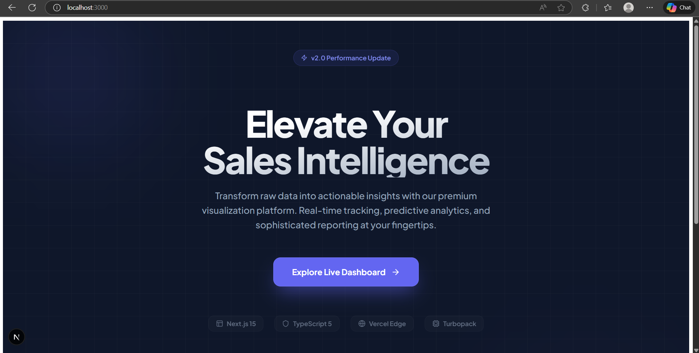
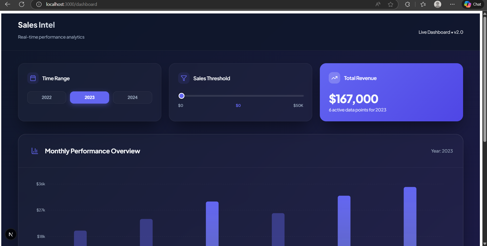

:
## 📊 Sales Dashboard

A sleek, interactive sales dashboard built with Next.js, TypeScript, Recharts, and modern CSS. Visualize and filter sales trends from 2022–2024 with beautiful charts. Deployed live, responsive, and optimized for usability.

---

| [🚀 Live Demo](https://my-sales-dashboard-git-main-sirajumer1s-projects.vercel.app) | [GitHub Repo](https://github.com/sirajumer1/my-sales-dashboard) |
| --- | --- |

---

## 📚 Features

- Interactive Bar Charts with year/sales threshold filtering
- Elegant, modern UI with gradients, glassmorphism, and cards
- Responsive and mobile-friendly design
- Built with Next.js 15 (App Router) and TypeScript
- Lightning-fast Vercel deployment and CI

---
## 🖥️ Screenshots

### Home pagee 

### chart of 2023
](public/screenshots/Screenshot 2026-01-22 130317.png)

### chart of 2024

## 🛠️ Tech Stack

- **Framework**: Next.js 15
- **Language**: TypeScript
- **Charts**: Recharts
- **Styling**: Modern CSS with gradients and effects
- **Deployment**: Vercel

---

## 📂 Project Structure
<pre>
Dashboard  |  Year/Threshold Controls
-----------+-------------------------
           |                         

my-sales-dashboard/
├── app/
│   ├── page.tsx         # Homepage
│   ├── dashboard/
│   │   └── page.tsx     # Dashboard UI
├── components/
│   └── chart.tsx        # Sales chart component
├── data/
│   └── sales.ts         # Mock sales data
├── styles/
│   ├── Dashboard.module.css
│   └── Home.module.css
├── public/
│   └── screenshots/
└── README.md
</pre>

---

## 🚦 Getting Started

### Prerequisites

- Node.js 18+
- npm or yarn

### Installation

git clone https://github.com/sirajumer1/my-sales-dashboard.git

cd my-sales-dashboard

npm install

### Devlopment

npm run dev

Open [http://localhost:3000](http://localhost:3000) in your browser.

---

## 🔗 Links

- **Live Demo**: [Visit here](https://my-sales-dashboard-git-main-sirajumer1s-projects.vercel.app)
- **GitHub Repo**: [sirajumer1/my-sales-dashboard](https://github.com/sirajumer1/my-sales-dashboard)

---

## ✨ Credits

- [Next.js](https://nextjs.org/) for SSR and app structure
- [Recharts](https://recharts.org/) for beautiful chart visualizations
- [Vercel](https://vercel.com/) for deployment

---

## Learn More

- Edit the homepage at `app/page.tsx`. The project auto-updates on edit.
- Uses [`next/font`](https://nextjs.org/docs/app/building-your-application/optimizing/fonts) for [Geist](https://vercel.com/font).

